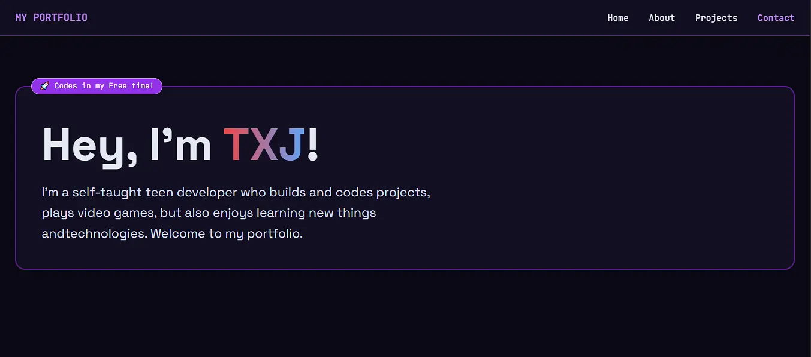

# MY-PORTFOLIO

A cozy, teen developer portfolio site built with HTML, Tailwind CSS, and vanilla JavaScript.


<p align="center">
  
</p>


## Project structure

```
MY-PORTFOLIO/
├── assets/
│   └──image.webp
├── index.html              # Main page (GitHub Pages entry point)
├── css/
│   └── styles.css          # Custom styles
├── js/
│   ├── tailwind.config.js  # Tailwind theme configuration
│   ├── projects.js         # Project cards + GitHub links
│   └── contact.js          # Contact form logic
├── LICENSE
└── README.md
```

## Features

- Sticky navigation with smooth scroll
- Hero, about, projects, and contact sections

## Run locally

Open `index.html` in your browser, or serve the folder with any static file server:

```bash
npx serve .
```

